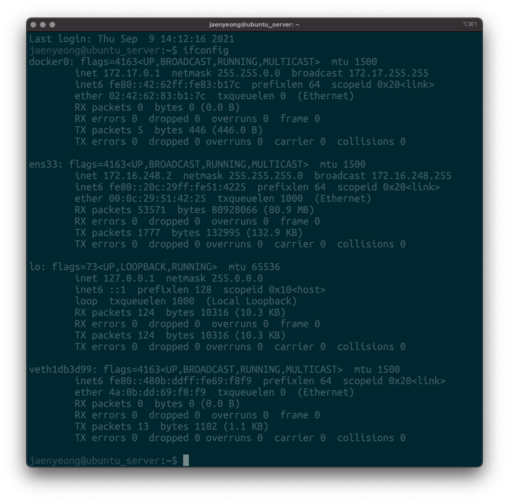

# 도커/쿠버네티스 온라인 부트캠프 with 카카오엔터프라이즈
[교육과정 보기](https://classlion.net/class/detail/21)
* 도커/쿠버네티스 A-Z 모두 배우는 6개월 집중 부트캠프
* 6개월 교육 과정 내 강의 노트와 과제 업로드

## [Settings]
실습 환경
* 순서
  * VMware Fusion Player 설치 및 실행
  * VMware Fusion에 Ubuntu 운영체제 설치
  * Ubuntu에 Docker 설치

VMware Fusion Player – 12.1.2 (for Intel-based Macs) / Personal Use License - Binaries
* [설치](https://my.vmware.com/group/vmware/evalcenter?p=fusion-player-personal)

Ubuntu - Bionic Beaver 18.04.5(LTS)
* [설치](https://mirror.kakao.com/ubuntu-releases/bionic/)
* 설치 시 mirror address 변경
  * `http://kr.archive.ubuntu.com/ubuntu >>> http://mirror.kakako.com/ubuntu (new)`
* 계정 설정
  ~~~
  username : jaenyeong
  password : ****
  ~~~
* 설치 완료 후 Vmware IP 확인 (ifconfig)
  * 172.16.248.2/24

SSH(Secure Shell) 접속 (22 포트)
* 접속 `sudo ssh jaenyeong@172.16.248.2`
* ssh config 설정
  * 편집기, 에디터 등으로 `~/.ssh/config` 실행, `HOSTNAME` 설정
    ~~~
    ## Docker&KBS
    Host docker_vm
    HostName 172.16.248.2
    user jaenyeong
    ~~~

Docker - Docker Engine on Ubuntu 20.10.8 (community)
* [설치](https://docs.docker.com/engine/install/ubuntu/)
* 로컬 터미널에서 SSH로 서버에 붙어 도커 설치 (위 SSH 접속방법대로 접속)
* 도커 저장소 설치 (저장소를 통해 도커 설치 및 업데이트 가능)
  ~~~
  [1] 패키지 매니저 업데이트
  $ sudo apt-get update

  $ sudo apt-get install \
    apt-transport-https \
    ca-certificates \
    curl \
    gnupg \
    lsb-release
  > 계속 진행을 원하냐는 질문에 y 입력

  [2] 도커 공식 GPG 키 추가
  $ curl -fsSL https://download.docker.com/linux/ubuntu/gpg | sudo gpg --dearmor -o /usr/share/keyrings/docker-archive-keyring.gpg

  [3] 안정화 버전의 저장소를 위한 설정
  $ echo \
    "deb [arch=amd64 signed-by=/usr/share/keyrings/docker-archive-keyring.gpg] https://download.docker.com/linux/ubuntu \
    $(lsb_release -cs) stable" | sudo tee /etc/apt/sources.list.d/docker.list > /dev/null
  ~~~
* 도커 엔진 설치
  ~~~
  [1] 패키지 매니저 업데이트
  $ sudo apt-get update

  [2-1] 최신 버전의 도커 엔진 설치
  $ sudo apt-get install docker-ce docker-ce-cli containerd.io
  > 계속 진행을 원하냐는 질문에 y 입력

  [2-2] 특정 버전의 도커 엔진 설치
  $ apt-cache madison docker-ce
  [or]
  $ sudo apt-get install docker-ce=<VERSION_STRING> docker-ce-cli=<VERSION_STRING> containerd.io

  [3] 정상적으로 도커 엔진이 설치 되었는지 확인
  $ sudo docker version
  $ sudo docker system info

  [4] 헬로우월드 이미지를 실행해 정상적으로 설치 되었는지 확인
  $ sudo docker container run hello-world
  ~~~

# 배운 점

## Chapter01
Intro

## Chapter02
도커 간단 정의
* 도커는 컨테이너에서 앱을 실행, 운영할 수 있도록 도와주는 플랫폼
* 도커는 IaaS, PaaS의 단점을 보완
  * IaaS는 이식성은 좋으나 불필요한 자원 사용에 대한 비용과 리소스 증가
  * PaaS는 비용과 리소스가 저렴하나 특정 클라우드에 종속된 앱을 마이그레이션 하기 쉽지 않음
* 설정은 PDF 파일 참조

컨테이너와 MSA(Micro Service Architecture)
* 컨테이너
  * Host OS에 앱의 실행 공간을 각각 구성하여 IP, 디렉터리 등을 분리시켜 놓은 것
* MSA
  * 앱 별로 요구되는 환경을 배타적으로 세팅한 각 컨테이너를 통합하여 구축한 큰 시스템

레지스트리(도커 이미지 저장소)
* 도커허브
  * 깃허브처럼 공개된 도커 레지스트리

도커 역할
* 앱이 실행되는데 필요한 각종 리소스들을 한데 묶어 하나의 이미지로 생성
  * OS, 미들웨어, 네트워크 설정 등
* 생성된 이미지를 컨테이너 실행에 사용

도커 정의 정리
* 도커는 앱과 앱의 실행 환경을 정의한 이미지를 생성, 공유
* 이와 동시에 생성한 이미지를 기반으로 컨테이너를 작동할 수 있도록 하는 플랫폼
* 개발, 테스트, 스테이징, 운영 등 각기 다른 환경 설정에 도움을 줌
* 또한 개발자가 배포까지 수행할 수 있는 환경 구축도 도와줌

## Chapter03
도커 컨테이너
* 앱이 실행되는 환경, 의존성, 정보 등을 담고 있음
* 컨테이너는 도커가 설정한 네트워크 설정 및 저장장치 등으로 구성
* 기본적으로 OS가 없음
* 각각의 컨테이너 안에 앱은 독립된 영역을 보장 받음

도커 엔진
* 이미지 및 컨테이너를 생성하고 실행하는 코어 기능을 수행하는 컴포넌트
* 일반적으로 '도커' 라는 용어는 도커 컴포넌트 중에 도커 엔진을 가리킴

도커 컴포넌트
* Docker Registry
  * 이미지 공유
* Docker Compose
  * 멀티 컨테이너 통합 관리
* Docker Machine
  * 클라우드 환경에서 도커 실행 환경 명령을 내려 설치(생성) 및 제어
* Docker Swarm
  * 클러스터 관리
  * 현재는 쿠버네티스가 표준으로 자리 잡아 스웜 대신 사용 (대체제)

자주 쓰이는 도커 실행 (컨테이너) 기본 명령어
* `run` (create + start) : 컨테이너 생성과 동시에 실행
  * `$ sudo docker container run -d -p 80:80 --name apache httpd:latest`
  * 이미 이미지를 가지고 있는 경우 충돌 발생
* `create` : 컨테이너만 생성
* `start` : 이미 생성된 컨테이너를 실행
  * `$ sudo docker container start apache`
* `-it` : `-i` + `-t`
  * `-i` (--interative) : 표준 입력창을 엶
  * `-t` (--tty) : 장치에 tty를 할당
  * `-it` 명령어를 붙이지 않으면 cli로 컨테이너 제어 불가능
* `--name` : 컨테이너의 이름 설정
  * 해당 명령으로 컨테이너의 이름을 직접 지정하지 않으면 무작위(임의로 조합)로 설정됨
* `rename` : 컨테이너 이름 재설정
  * `$ sudo docker rename [my_container] [my_new_container]`
  * `$ sudo docker rename apache apache_server`
* `-d` (--detach) : 컨테이너를 백그라운드에서 실행
* `-p` (--publish) : 호스트/컨테이너 간에 포트포워딩 세팅
  * `$ sudo docker -p [docker port]:[local port]`
  * 백그라운드에 한정된 명령은 아님
* `exec` : 컨테이너 외부에서 컨테이너 내부의 프로세스 실행
  * `$ sudo docker container exec -it apache /bin/echo "Hello, Docker!"`
  * `$ sudo docker container exec -it apache bash`
* `logs` : 로그 출력
* `stop` : 컨테이너 중지
  * `$ sudo docker container stop apache`
* `restart` : 컨테이너 재시작(종료 후)
  * `$ sudo docker container restart apache`
* `attach` : 구동 중인 컨테이너에게 연결
  * `$ sudo docker container attach apache`
* `top` : 컨테이너 내부의 구동중인 프로세스 확인
  * `$ sudo docker container top apache`
* `stats` : 컨테이너 구동 확인
  * `$ sudo docker container stats apache`
  * `$ sudo docker container stats apache --format "table {{.Container}}\t{{.CPUPerc}}\t{{.MemUsage}}"`
* `ls` : 컨테이너 목록 조회
  * `$ sudo docker container ls`
* `cp` : 컨테이너 내부에 파일 복사
  * `sudo docker cp [OPTIONS] SRC_PATH|- CONTAINER:DEST_PATH`
  * `$ sudo docker container cp apache:/usr/local/apache2/htdocs/index.html /tmp/index.html`
  * `$ sudo docker container cp /tmp/index.html apache:/usr/local/apache2/htdocs/index.html`
* `diff` : 컨테이너 변경 사항 확인
  * `$ sudo docker diff apache`
  * A(added), C(changed), D(deleted)
  ~~~
  C /usr
  C /usr/local
  C /usr/local/apache2
  C /usr/local/apache2/htdocs
  C /usr/local/apache2/htdocs/index.html
  C /usr/local/apache2/logs
  A /usr/local/apache2/logs/httpd.pid
  C /root
  A /root/.bash_history
  ~~~

컨테이너의 종류
* 대화형 컨테이너
  * 실시간으로 리소스를 모니터링 하는 것과 같이 CLI를 직접 사용하는 경우
  * 최신 버전의 센토스 이미지를 사용하여 컨테이너 생성하여 실행
    ~~~
    $ sudo docker container run --interative --tty --name centos centos:latest
    $ sudo docker container run -i -t --name centos centos:latest
    $ sudo docker container run -it --name centos centos:latest
    모두 동일한 명령어
    ~~~
    * 센토스 정상 실행 확인 (루트 권한으로 실행됨)
      * `echo "Hello, Docker!"` 명령으로 확인 (CLI `#`표시 확인)
* 백그라운드 컨테이너
  * 레지스트리용 컨테이너, 웹서버 실행 등의 경우 (일반적으로 사용되는 경우)
  * 최신 버전의 아파치 웹서버 이미지를 사용하여 컨테이너 생성하여 실행
    ~~~
    $ sudo docker container run -d -p 80:80 --name apache httpd:latest
    ~~~

실행중인 컨테이너 확인
* CLI 명령으로 확인
  * `$ sudo docker container ls`
* 브라우저에서 접속하여 확인
  * `http://172.16.248.2:80`
* 웹서버의 로그 확인
  * `$ sudo docker container logs apache`

도커 컨테이너 생명주기 (Lifecycle)
* 생성, 시작, 정지, 삭제

## Chapter04
도커 이미지
* 도커 이미지는 실행에 필요한 모든 것을 담고 있음
* 실행에 필요한 이미지가 없는 경우 도커허브(레지스트리)에서 해당 이미지를 찾아 받아옴
* 이미지는 단일 이미지인 경우가 거의 없음 (대부분 다중 이미지)
* 즉 이미지는 베이스 이미지 위에 설정, 파일들을 한데 모아 빌드한 것
* 도커 파일을 통해 이미지 생성
* `Digest` - 도커 허브에서 이미지를 식별하는 고유 값
* 태그는 이미지를 버전별로 관리하는데 사용됨
  * 태그 중 `latest`는 장기 지원 버전을 의미
  * 레지스트리별로 명명 규칙이 상이하게 존재하기 때문에 태그를 통해 이미지명 설정
* 도커 허브의 `Official Image`는 공식적으로 인증을 받은 이미지

도커 이미지 명령어
* `pull` : 도커 이미지 받기
  ~~~
  > 아래 3개는 모두 같은 명령어
  $ sudo docker image pull ubuntu
  $ sudo docker image pull ubuntu:focal
  $ sudo docker image pull ubuntu:latest
  
  $ sudo docker image pull 이미지명[:태그]
  ~~~
* `ls` : 이미지 목록 조회
  * `$ sudo docker image ls`
  * 옵션
    * `--all`, `-a`
      * 숨겨진 중간 단계에 이미지까지 모두 조회
    * `--format`
      * 출력 포맷 설정
    * `--digests`
      * 다이제스트를 포함하여 조회
    * `--quiet`, `q`
      * 이미지 ID만 조회
* `inspect` : 이미지 정보 조회 (JSON 형식)
  * `$ sudo docker image inspect ubuntu:18.04`
  * 원하는 내용만 조회
    * `$ sudo docker image inspect --format="{{ .RepoTags }}" ubuntu:18.04`
* `tag` - 이미지에 태그 설정
  ~~~
  $ sudo docker image tag ubuntu:18.04 jaenyeong/ubuntuos:1.0
  
  $ sudo docker image tag 대상이미지명[:태그] [사용자명/]이미지명[:태그]
  ~~~
* `rm` : 삭제
  * 옵션
    * `--force`, `-f`
      * 이미지 강제 삭제
      * 태그된 이미지를 삭제하면 태그만 풀림
      * 여러곳에서 링크된 이미지는 삭제가 불가능 하기 때문에 해당 옵션 사용
    ~~~
    sudo docker image rm jaenyeong/ubuntuos:1.0
    sudo docker image rm ubuntu:18.04
  
    sudo docker image rm 이미지명[:태그]
    sudo docker image rm 이미지ID
    ~~~
* `container commit` : 실행중인 컨테이너로부터 이미지 생성
  * 컨테이너의 당시 상태를 스냅샷 상태로 본떠 생성
  * 옵션
    * `--author`, `-a`
      * 이미지 작성자 등록
    * `--message`, `-m`
      * 커밋 메시지 등록
  ~~~
  # 사전에 실행
  $ sudo docker container run -d -p 80:80 --name apache httpd
  
  $ sudo docker container commit -a "jaenyeong" apache jaenyeong/apacheweb:1.0
  ~~~
* `container export` : 실행중인 컨테이너로부터 파일 생성
  ~~~
  $ sudo docker container export apache > apache.tar
  # sudo docker container export 컨테이너명 > [경로/]파일명
  ~~~
  * 생성한 파일을 `import` 명령어를 사용하여 이미지 생성 가능
* `image` : 파일을 이미지로 생성
  * `$ sudo docker image import apache.tar jaenyeong/apacheweb:1.1`
  * `container`가 아닌 `image`로 명령 실행

Dockerfile
* 새로운 도커 이미지를 생성하는데 필요한 베이스 이미지, 설정을 작성한 파일
* 예시
  ~~~
  FROM ubuntu:18.04
  
  RUN apt-get -y update && apt-get -y upgrade
  RUN apt-get -y install nginx
  
  EXPOSE 80
  
  CMD ["nginx", "-g", "daemon off;"]
  ~~~
  * `ubuntu`에 `nginx` 웹서버를 설치하고 80 포트를 열어놓는 내용
  * `FROM`
    * 베이스 이미지 설정
  * `RUN`
    * 이미지를 생성에 필요한 미들웨어나 앱을 세팅하기 위한 명령을 실행
  * `EXPOSE`
    * 호스트와 연결할 포트 설정
  * `CMD`
    * 생성된 이미지를 기반으로 구동된 컨테이너에서 명령을 실행
    * 하나의 `Dockerfile`에서 한 번의 명령만 유효

Dockerfile 빌드
* 도커에서 빌드는 `Dockerfile`을 기반으로 이미지를 생성하는 것
  ~~~
  $ mkdir docker && cd docker
  $ touch Dockerfile
  $ nano Dockerfile
  
  $ sudo docker build -t sample:1.0 /home/(USER)/docker
  ~~~
  * `sudo docker build -t` : 도커 이미지를 생성하는 기본 명령
  * `sample:1.0` : 태그, `[이미지명]:[버전]`과 같은 형태로 작성
  * `/home/(USER)/docker` : 경로

Dockerfile 명령어
* `FROM` : 베이스 이미지 설정
  * 일반적으로 도커 허브의 이미지를 탐색해 빌드하지만 사용자가 생성한 이미지를 통해 빌드도 가능
* `RUN` : 이미지를 빌드할 때 실행할 명령 설정
  * `RUN`을 통해 작동하는 명령은 아직 컨테이너가 작동하는 상태가 아님 
  * Shell, Exec 형식으로 작성 가능
  * 두 가지가 혼용되는 경우가 많음, 실행할 셸 혹은 프로그램을 지정한다는 측면에서 Exec 형식을 더 권장
* `CMD` : 이미지를 통해 생성된 컨테이너 내부에서 실행되는 명령
  * 사용자가 넘긴 인수의 값을 사용
  * `CMD` 명령은 단 하나만 유효, 여러 개의 명령이 있다면 마지막 것만 실행
* `ENTRYPOINT` : 이미지를 통해 생성된 컨테이너 내부에서 실행되는 명령
  * 사용자가 넘긴 인수의 값을 사용하지 않고 설정한 기본값으로 명령 실행
  * `ENTRYPOINT` 명령 또한 단 하나만 유효, 여러 개의 명령이 있다면 마지막 것만 실행
  * 문서에 의하면 일반적으로 셸 스크립트를 작성하여 `ENTRYPOINT`로 실행하는 방식으로 작성
    * 서비스를 이미지로 생성, 여러 명령을 실행해야 하는 경우
* `CMD`, `ENTRYPOINT` 명령 추가 설명
  * `Shell`, `Exec` 형식 모두 사용 가능
    * `Shell`
      * `CMD echo "Hello World!"`
    * `Exec`
      * `CMD ["/bin/echo", "Hello World!"]`
    * 일반적으로 `Exec` 형식 사용을 권장
  * 차이
    * 가장 큰 차이는 명령어 인수의 처리 유무
    * `ENTRYPOINT` 명령은 사용자가 어떤 인수를 명령으로 넘기더라도 `Dockerfile`에 명시된 명령을 그대로 실행
    * `CMD` 명령은 컨테이너를 실행할 때 사용자가 인수를 넘기면 기존에 작성된 내용을 덮어씀
  * 함께 사용하는 경우
    * 문서에 의하면 `ENTRYPOINT`와 `CMD`를 함께 사용하는 경우 `CMD` 명령이 `ENTRYPOINT` 명령의 파라미터(인수)로 붙음
      * `CMD`, `ENTRYPOINT` 선언 순서는 상관없음
    * 따라서 명령 인수가 필요없는 내용은 `ENTRYPOINT`로 실행, `CMD` 명령으로 인수 명령 실행
* `ONBUILD` : 이미지 빌드 완료 후 명령 실행
  * 실제로 빌드 후 아무 동작도 일어나지 않음
  * `ONBUILD`가 작성된 `Dockerfile`을 베이스 이미지로 한 자식 이미지 파일을 빌드할 때 실행
* `HEALTHCHECK` : 컨테이너의 상태 체크
  * 해당 옵션으로 컨테이너 내부에 로그를 남길 수 있음
  * 옵션
    * `--interval` : 컨테이너 체크 간격 설정
    * `--timeout` : 설정한 시간에 정상작동 하지 않으면 타임아웃 처리
    * `--retries` : 재시도 횟수 설정
* `ENV` : 환경변수 설정
  * `RUN`, `CMD`, `ENTRYPOINT`에서 모두 사용 가능
  * 변수 앞에 `$`를 접두사로 붙여 사용 가능
  * 해당 변수는 컨테이너가 구동된 후에도 유효
* `WORKDIR` : 작업 디렉토리 할당
  * 리눅스의 `cd`와 유사
  * `Dockerfile` 내부에서 경로를 이동할 때 사용 + 이렇게 빌드된 이미지를 대화형 컨테이너로 실행할 때 프롬프트의 최초 위치를 결정
* `USER` : 특정 사용자 할당
  * 기본적으로 `ubuntu`가 베이스 이미지라면 기본 유저는 `root`
* `LABEL` : 이미지 버전 정보, 작성자 등 레이블 정보 등록
  * 각종 메타데이터를 이미지에 기록
  * `docker image inspect` 명령어 실행 후 `Labels` 항목에서 확인 가능
* `ARG` : `Dockerfile` 내부의 변수를 설정
  * 빌드 시점에만 유효한 변수를 할당
  * `ENV`와 다르게 명령어를 실행할 때만 작동
  * 일반적으로 인증 키 정보 등을 변수로 선언하는 경우가 많은데 `docker history`로 조회가 가능하니 주의할 것
* `EXPOSE` : 포트 할당
  * 단순히 포트의 사용 방식을 알려주는 문서의 성격을 띔
  * 실제로 호스트에서 컨테이너의 포트와 통신하도록 listening 상태를 만들어주지 않음 (외부로 노출되지 않음)
  * 컨테이너에서 호스트의 통신 요청에 응답하기 위해서는 반드시 `container run` 단계에서 `-p` 옵션을 통해 포트를 설정해야 함
* `ADD` : 파일 또는 디렉토리 추가
  * `COPY` 명령과 유사한 기능을 제공하나 2개의 추가 기능 보유
    * `URL`을 통한 파일 복사
      * 이는 로컬뿐 아니라 웹에 파일도 이미지를 빌드할 때 추가 가능함을 의미 
    * 로컬에서 파일을 복사하는 경우 압축을 해제하여 복사
      * 웹에서 다운로드한 파일은 압축은 해제되나 `tar` 형태는 유지
      * 압축을 자동으로 해제하기 때문에 `tar`, `tar.gz` 등의 파일을 복사하는 경우 주의
  * `ADD` 명령어 뒤에 URL을 사용하여 파일 다운로드 후 추가하는 방법은 권장하지 않음
    * 불필요한 용량을 낭비하게 됨
    * 이런 경우 `curl`, `wget` 등을 `RUN`과 함께 사용하여 내려 받은 후 `COPY` 명령으로 로컬 파일을 복사할 것을 권고
* `COPY` : 파일 복사
* `VOLUME` : 볼륨 마운트
* `STOPSIGNAL` : 시스템 콜 시그널 설정
* `SHELL` : 컨테이너에서 사용할 기본 쉘 설정

## Chapter05
도커 레지스트리
* 도커의 이미지 저장소
* Building, Running, Shipping(Sharing)
* 공유 레지스트리 종류
  * 도커 허브 (default)
  * 로컬 레지스트리 (사용자가 직접 구축)
  * 컨테이너 레지스트리 (클라우드 사업자가 제공)
* 레지스트리를 사용하는 이유
  * 보안 (IAM)
    * 이미지 자체 암호화가 필요
    * 접근 권한 통제
  * 배포 파이프라인 효율화
    * CI/CD

도커 허브
* 기본적으로 참조하는 레지스트리
* [도커허브](https://hub.docker.com/) 계정, 저장소 생성
  * 무료 계정 제약 사항
    * 하나의 저장소만 Private 설정 가능
    * `Automated Builds` 기능 사용 못함
      * `push`한 소스를 기반으로 이미지를 빌드해주는 기능
* 샘플 코드 복사
  ~~~
  $ mkdir /<프로젝트명>
  $ cd /<프로젝트명>
  $ git clone https://github.com/jaenyeong/Sample_Docker-portfolio.git
  ~~~
  * 이미지 빌드
    ~~~
    $ sudo docker build -t <계정명>/<저장소명>:[태그명] .
    $ sudo docker build -t jaenyeongdev/portfolio:1.0 .
    ~~~
    * ~~~
      # alpine은 경량화 리눅스 배포판 입니다.
      # 도커 베이스 이미지로 alpine 리눅스를 활용하는 이유는
      # 이미지 용량을 적게 차지할 뿐만 아니라 처리속도가 빠르기 때문
      FROM nginx:alpine
    
      # 이 경로는 nginx 웹서버의 index.html 파일이 위치한 곳
      # 브라우저를 통해 웹서버로 접근했을 때 로드되는 페이지가 바로 이 곳을 참조하여 렌더링
      WORKDIR /usr/share/nginx/html
    
      # 클론한 소스를 이미지에 복사하기 위해 기존 이미지 내의 파일을 전부 삭제
      RUN rm -rf ./*
    
      # Dockerfile이 위치한 경로의 html, css, js 등의 파일을 이미지 내로 복사
      COPY ./* ./
    
      # nginx 웹서버 기동
      ENTRYPOINT ["nginx", "-g", "daemon off;"]
      ~~~
* 도커 허브에 이미지 공유 시엔 빌드할 때 반드시 명명규칙 준수할 것
  * `<계정명>:<저장소명>`
* 도커 허브 로그인
  * `$ sudo docker login`
* 도커 허브 이미지 공유
  ~~~
  $ sudo docker <계정명>/<저장소명>:[태그명]
  $ sudo docker push jaenyeongdev/portfoilo:1.0
  ~~~

로컬 레지스트리
* 이미지가 저장되는 레지스트리를 컨테이너 상에 구축할 수 있음
* 도커에서 `Registry`라는 이름으로 제공
* `Registry` 컨테이너 실행
  ~~~
  # --restart always는 도커 엔진이 재시작 될 때 자동으로 컨테이너를 재시작하도록 하는 옵션
  $ sudo docker run -d -p 5000:5000 --restart always --name registry registry:2
  ~~~
* 이미지 태깅
  ~~~
  $ sudo docker tag <기존 이미지명>:[태그명] <레지스트리 컨테이너 IP>/<이미지명>:[태그명]
  $ sudo docker tag jaenyeongdev/portfoilo:1.0 localhost:5000/portfolio:1.0
  ~~~
* 컨테이너에 구축한 레지스트리에 이미지를 공유하는 경우 반드시 명명규칙 준수할 것
  * `<컨테이너 IP>:<포트>/<이미지명>`
  * 컨테이너를 실행할 때 `5000`으로 지정한 포트를 구성상 변경이 필요한 경우 태그 설정에도 반영 필요
* 이미지 공유
  * `$ sudo docker push localhost:5000/portfolio:1.0`

GCP Artifact Registry
* 패키지와 도커 컨테이너 이미지를 저장, 관리
  * CI/CD
    * `Cloud Build`의 아티팩트 저장, `Google Cloud` 런타임에 배포
  * 공급망
  * VPN 서비스 제어 (보안)
  * 단일 프로젝트 내 여러 저장소 생성 가능
* GCP 콘솔 > 프로젝트 생성
  * GCP에서는 프로젝트 단위로 앱을 관리
    * `Firebase` 등의 서비스도 GCP에서 관리되는 요소 중 하나
* 결제 계정 생성
* 서비스 사용 등록
  * `API 및 서비스 - 라이브러리` 메뉴 참조
    * `Artifact Registry`, `Cloud Build` 서비스 사용 선택
* GCP 저장소 생성
  * `Artifact Registry` 콘솔에서 `저장소 만들기` 선택
  * 저장소 설정
    * 형식 `Docker`
    * 리전 `asia-northeast3(서울)`
  * 암호화 `Google 관리 암호화` 선택
* 리눅스 도커 보안 그룹 설정
  * `$ sudo usermod -a -G docker [계정명]`
* google cloud SDK 패키지 경로 추가
  * `$ echo "deb [signed-by=/usr/share/keyrings/cloud.google.gpg] https://packages.cloud.google.com/apt cloud-sdk main" | sudo tee -a /etc/apt/sources.list.d/google-cloud-sdk.list`
* google cloud SDK 공개키 내려받기
  * `$ curl https://packages.cloud.google.com/apt/doc/apt-key.gpg | sudo apt-key --keyring /usr/share/keyrings/cloud.google.gpg add -`
* google cloud SDK 설치
  * `$ sudo apt-get update && sudo apt-get install google-cloud-sdk`
* google cloud SDK 초기화
  * `gcloud init`
  * 위 명령 실행 후 google 계정에 로그인 링크 > 링크에 접속, 인증코드를 복사 > 프롬프트에 붙여넣기
* GCP Registry 저장소 인증
  * `$ sudo gcloud auth configure-docker asia-northeast3-docker.pkg.dev`
  * 해당 명령은 루트 권한이 필요, 반드시 `sudo` 명령 같이 사용
  * 실행 후 `/home/<usename>/docker/config.json` 파일과 함께 저장소 경로가 등록 됨
* 이미지 태깅
  ~~~
  # sudo docker tag jaenyeongdev/portfolio:1.0 asia-northeast3-docker.pkg.dev/[프로젝트ID]/[저장소명]/portfolio
  $ sudo docker tag jaenyeongdev/portfolio:1.0 asia-northeast3-docker.pkg.dev/jaenyeong-docker-registry/portfolio/portfolio
  ~~~
  * GCP의 레지스트리에도 이미지를 업로드 할 때 반드시 이미지명 명명규칙 준수
* 이미지 공유
  ~~~
  # sudo docker push asia-northeast3-docker.pkg.dev/[프로젝트ID]/[저장소명]/portfolio
  $ sudo docker push asia-northeast3-docker.pkg.dev/jaenyeong-docker-registry/portfolio/portfolio
  ~~~

GCP Cloud Build
* GCP에서 제공되는 도커 이미지 자동 빌드 기능
  * `Github`, `Bitbucket`의 `push` 된 소스를 기반으로 도커 이미지를 자동으로 빌드
* 트리거 생성, 저장소 연결
  * 'Cloud Build' 메뉴에서 '트리거'를 누른 후 저장소 `연결` 버튼 선택
  * `Github` 선택 후 로그인
  * 계정 연동 여부 창 > `Authorize Google Cloud Build` 선택
  * `push` 내역을 가져오기 위해 `Google Cloud Build 설치` 선택
  * 설치 대상 계정 선택
  * `Google Cloud Build` 적용
    * 계정에 생성된 저장소 전체에 적용
      * `All repositories` 선택 후 `Install` 선택
    * 특정 저장소만 적용
      * `Only Select repositories` 선택 후 `Install` 선택
  * GCP `Cloud Build` 기능을 적용할 저장소를 선택, `확인` 버튼 선택
  * 전송, 트리거 설명 체크박스에 체크
* 트리거 설정
  * 이벤트 > `브랜치로 푸시` 선택
  * 구성 > `Dockerfile` 선택
* 서비스 계정 권한 사용 설정
  * `Cloud Build` 설정의 서비스 계정 탭 > 표시된 두 항목을 '사용 설정됨' 상태로 변경
* `Github`에 소스 `push` 후 빌드 확인
  * 빌드와 관련한 성공/실패 로그는 GCP 대시보드에서 확인 가능

## Chapter06
도커 네트워크/볼륨
* 네트워크
  * 복수의 디바이스가 연결되어 있는 것
* 프로토콜
  * 연결된 디바이스 간 데이터를 주고 받는 규칙

`$ ifconfig`
* `$ ifconfig # Linux/macOS`
* `$ ipconfig # Windows`

* `ens33`
  * 디바이스의 `NIC(Network Interface Controller)`를 나타내는 부분
  * 일반적으로 `NIC`는 `LAN 카드`라고 불리며 호스트와 네트워크 통신망 사이에서 데이터 송수신 역할
    * 일반 PC에는 물리 `NIC`가 내장
  * 사양 페이지에 `Ethernet` 관련 포트가 유선으로 외부 통신망과 호스트 디바이스를 연결해주는 매개체
  * 구버전 리눅스에는 `eth0`, `eth1`
* `lo`
  * `localhost` (`Loopback Network Interface`에서 비롯된 용어)
    * 디바이스가 자기 자신을 가리키는 것
    * 웹 서버를 구동한 `PC` 브라우저에서 접속, 테스트가 가능한 것이 `Loopback` 네트워크 덕분
  * `OS`에는 내부적으로 `HostName`, `IP`를 매핑(설정)해둔 파일이 존재
    * 우분투, 맥 등은 `/etc/hosts`
* `inet`, `inet6`
  * `inet`
    * `IPv4`를 의미
    * 12자리, 32비트로 구성되어 있으며, 10진수로 4옥텟으로 분할 표기
  * `inet6`
    * `IPv6`를 의미 (`IPv4` 대체용)
    * 128비트로 구성되어 있으며, 16진수로 8옥텟으로 분할 표기
    * `0` 값을 가지는 경우 생략 가능 (실제 조회되는 주소값은 `8` 옥텟보다 적을 수 있음)
  * `Private IP` (사설 `IP`)
    * 모든 디바이스가 `Public IP` (공인 `IP`)가 필요하지는 않음
    * 하나의 공인 `IP`로 다수의 디바이스가 통신망에 접근 가능
    * 라우터로 묶인 네트워크 통신망을 `LAN(Local Area Network)`이라 함
    * `LAN`이 모여 `WAN(Wide Area Network)` 구성
* `port`
  * 해당 `IP` 주소의 입구라고 봐도 무방
  * `IANA(Internet Assigned Numbers Authority)` 인터넷 할당 번호 관리 기관
    * `FTP` : 20,21
    * `SSH` : 22
    * `TELNET` : 23
    * `SMTP` : 25
    * `DNS` : 53
    * `POP3` : 110
    * `HTTP` : 80
    * `HTTPS` : 443

호스트-컨테이너 네트워크
* `NIC(Network Interface Controller)`
  * 일반적으로 `LAN 카드`라고 불림
  * 호스트와 네트워크 간 데이터를 송수신하는 인터페이스
  * 물리적으로 구성된 `NIC`는 `ens33`으로 인식
    * 구버전 리눅스 배포판에서는 `eth0`으로 인식되어 있으나 물리적인 `NIC`라고 봐도 무방
* `NAPT(Network Address Port translation`
  * `IP`, `Port`를 변환하는 기술
  * 도커 엔진이 컨테이너에 부여한 `IP`는 사설이기 때문에 호스트에서 직접 접근 불가
  * 접근을 가능하게 하기 위해 호스트의 각 `Port`에 컨테이너의 `IP`, `Port`를 매핑
* `docker0`(Virtual bridge)
  * `bridge` 형태의 네트워크로 도커 엔진 실행 시 자동 생성
  * 컨테이너가 실행되면 내부의 모든 포트를 `docker0`에 개방
  * 호스트는 `NIC`에서 직접 컨테이너와 연결하는 것이 아니라 `docker0`를 경유
  * 포트를 통해 컨테이너에 접근할 수 있도록하는 다리 역할
* `veth` + 난수
  * 컨테이너가 호스트와 통신하기 위한 가상의 `NIC`
  * `veth + 난수` 형태로 생성
  * 컨테이너 측면에서는 가상 `NIC`(`veth+난수`)를 `eth0`라고 인식

도커 네트워크
* `bridge`
  * `docker0`를 `Gateway`로 컨테이너가 생성된 순서대로 `IP` 부여
    * `Gateway`는 네트워크에 접근하기 위한 출입구
    * 서로 다른 네트워크에 접근을 하기 위해서는 `Gateway` 주소가 필요, 기본적으로 `IP` 마지막 자리를 `1`로 설정
  * 별도의 설정이 없다면 모든 컨테이너는 구동 시 `docker0`에 연결
    * 이를 통해 컨테이너 간 통신도 가능하게 됨
    * 별도의 `bridge`를 구축, 컨테이너를 연결한다면 `docker0`에 연결된 컨테이너와는 통신이 불가능
  ~~~
  $ sudo docker container run -d -p 80:80 --name webserver1 httpd
  $ sudo docker container run -d -p 8080:80 --name webserver2 httpd
  $ sudo docker container run -d -p 8081:80 --name webserver3 httpd

  $ sudo docker container inspect --format="{{ .NetworkSettings IPAddress }}" webserver1 webserver2 webserver3
  ~~~
* `host`
  * `host` 네트워크는 도커 엔진이 작동하고 있는 `Host`의 `IP` 주소를 그대로 사용하는 것
  * `bridge`를 통해 `NAPT` 과정을 거치지 않아도 됨
    * 명시적으로 컨테이너의 포트를 명령에 작성하지 않아도 됨
  * 격리된 네트워크로 구성하지 않고, 도커 엔진과 한 공간에 두는 것
  * `Host` OS가 리눅스인 경우만 지원 (도커 테스크탑 형태는 지원하지 않음)
  ~~~
  $ sudo docker container run -it --network host --name ubuntu-host ubuntu:18.04

  root@ubuntu_server:/# apt-get update
  root@ubuntu_server:/# apt-get install net-tools
  ~~~
* `none`
  * 컨테이너를 격리된 공간에 차단, 어떤 네트워크와도 연결하지 못하게 하는 것
  ~~~
  $ sudo docker container run -it --network none --name ubuntu-none ubuntu:18.04
  
  # 네트워크 단절로 실패
  root@307b5c4db442:/# apt-get update
  ~~~

도커 네트워크 명령어
* 기본적으로 생성되는 네트워크 확인
* `ls` : 네트워크 목록 조회
  * 옵션
    * `--filter`
      * 조회 필터 설정
      ~~~
      $ sudo docker network ls
      $ sudo docker network ls --filter driver=bridge
      ~~~
      * `name`, `scope` 등도 조건으로 설정 가능
* `create` : 네트워크 생성
  * 옵션
    * `--driver`
      * 네트워크 종류 선택 (기본 값은 `bridge`)
      ~~~
      $ sudo docker network create --driver=bridge new-bridge
      ~~~
      * 일반적으로 명령어를 통한 생성 보다는 `docker-compose.yaml` 내에 세팅
* `connect` : 컨테이너를 네트워크에 연결
  ~~~
  $ sudo docker network connect new-bridge webserver1

  # 연결 상태 확인
  $ sudo docker container inspect webserver1
  ~~~
  * 하나의 컨테이너가 두 개의 네트워크에 각각 공유
    * 기존에 디폴트로 연결되어 있는 `bridge` 네트워크는 유지
    * 새롭게 `new-bridge`와 추가 연결
  * 두 네트워크 끼리는 다른 게이트웨이로, 통신 불가능
  * 컨테이너는 두 대역 모두 통신 가능
  ~~~
  $ sudo docker container run -d -p 8082:80 --name=webserver4 --net=new-bridge httpd
  $ sudo docker container inspect webserver4
  ~~~
  * `--net` 옵션을 추가하여 컨테이너를 생성하면 디폴트 네트워크 설정(`bridge`)을 연결하지 않고 명령어 값인 `new-bridge`만 연결
* `disconnect` : 컨테이너를 네트워크에서 해제
  * `$ sudo docker network disconnect new-bridge webserver1`
* `inspect` : 네트워크 상세 정보 조회
  * `$ sudo docker network inspect new-bridge`
* `rm` : 네트워크 삭제
  * `$ sudo docker network rm new-bridge`

도커 볼륨
* 도커에서는 `Volume`과 `Bind Mount`라는 개념으로 `Host`의 일부 영역을 할당해 스토리지로 지원
* `Bind Mount`
  * 초기 도커에서 사용된 스토리지 기능
  * `Host` 경로 일부를 설정해 컨테이너에 마운트하는 기능을 가리킴
  * `/Desktop` 경로를 USB 삼아 컨테이너와 연결하는 것과 유사
  * 컨테이너 실행 시 `-v` 옵션 사용
  ~~~
  $ sudo mkdir /home/ubuntu/bindmount-test
  $ sudo cd /home/ubuntu/bindmount-test
  $ sudo touch bindmount.txt
  $ sudo echo "bind-mount" > bindmount.txt

  $ sudo docker container run -d -it --name bindmount -v /home/ubuntu/bindmount-test:/bindmount-test ubuntu:18.04
  $ sudo docker container run -v [호스트 경로]:[컨테이너 경로] [이미지명:태그]
  ~~~
* `Volume`
  * `Bind Mount` 이후에 나온 개념
  * 호스트의 경로를 임의로 지정할 수 없음
  * 대신 도커 엔진에서 관리하는 `/var/lib/docker/volumes/<볼륨명>`으로 세팅
  * 컨테이너를 실행하는 단계에서 생성 가능
    * 볼륨만 개별적으로 생성 가능
  ~~~
  $ sudo docker container run -d -it --name volume -v volume1:/volume-test ubuntu:18.04
  $ sudo docker container attach volume

  root@53b1ffc4f0e8:/# echo "volume" > ./volume-test/volume.txt
  $ exit

  $ cd /var/lib/docker/volumes/volume1/_data
  $ cat volume.txt
  ~~~
  * 지정 볼륨명인 `volume1` 디렉토리 생성 됨
  * 볼륨을 통해 저장된 데이터는 `var/lib/docker/volumes/volume1/_data`에 저장
    * 컨테이너에서 입력한 문자열 텍스트 파일이 호스트에도 동일한 내용으로 조회 가능
    * `$ sudo docker volume create volume2`

## Chapter07
도커 컴포즈
* 멀티 컨테이너를 구성하는 컴포넌트 (`Compose` 뜻은 구성하다)
  * 여러 컨테이너를 정의, 실행
  * `docker-compose.yml` 파일로 설정

사용법
* 사용하기 위해선 별도의 설치 필요 (도커 데스크탑에는 내장되어 있음)
  * `$ sudo curl -L "https://github.com/docker/compose/releases/download/1.29.2/docker-compose-$(uname -s)-$(uname -m)" -o /usr/local/bin/docker-compose`
* 실행 권한 부여
  * `$ sudo chmod +x /usr/local/bin/docker-compose`
* 버전 확인
  * `$ docker-compose --version`

`YAML` 또는 `YML`
* `YAML` 또는 `YML` 파일은 `Ain't Markup Language`의 약자
  * 원래 `Yet Another Markup Language`였으나 후에 변경됨
* 시스템 간 데이터 교환 목적, `key-value` 구조
* 문법
  * 대소문자 구분
  * 들여쓰기 시 탭이 아닌 스페이스로 구분
  * 값으로 `String`, `Number`, `Boolean` 모두 사용 가능
  * `:` 바로 뒤에는 한 칸 떼고 작성
  * 값 나열 시 `-` 입력 후 한 칸 떼고 작성
  * 주석은 `#` 사용
  
`docker-compose.yml` 구조 예시
* Nextcloud 와 관계형 DB postgresql 컨테이너 구성 설정
  ~~~yaml
  version: "3.9"
  services:
    db:
      image: postgres:alpine
      environment:
        - POSTGRES_PASSWORD=nextcloud
        - POSTGRES_DB=nextcloud
        - POSTGRES_USER=nextcloud
      restart: always
      volumes:
        - db_data:/var/lib/postgresql/data

    nc:
      image: nextcloud:apache
      environment:
        - POSTGRES_HOST=db
        - POSTGRES_PASSWORD=nextcloud
        - POSTGRES_DB=nextcloud
        - POSTGRES_USER=nextcloud
      ports:
        - "80:80"
      restart: always
      volumes:
        - nc_data:/var/www/html
      depends_on:
        - db
  volumes:
    nc_data:
    db_data:
  ~~~
* 컨테이너 구동 후 브라우저 접속
  * 관리자 계정 설정 창에서 값 입력 후 `Finish setup` 버튼 클릭
* 계정 생성이 완료, 필요한 모듈이 설치되면 컨테이너를 구글 드라이브처럼 사용 가능

도커 컴포즈 명령어
* 명령어는 기본적으로 `docker-compose.yml` 파일이 위치한 경로에서 실행
* `up` : 멀티 컨테이너 생성, 실행
  * `$ sudo docker-compose up`
  * 컨테이너명은 별도로 설정하지 않으면 `[docker-compose.yml 파일이 위치한 디렉터리명]_[서비스명]_[번호]`
  * 옵션
    * `-d`, `--detach`
      * 컨테이너를 백그라운드에서 실행
    * `--build`
      * 컨테이너 생성 전 이미지 빌드
    * `--no-build`
      * 실행 대상 이미지가 없더라도 빌드하지 않음
    * `--abort-on-container-exit`
      * 여러 컨테이너 중 하나라도 종료되면 모두 종료
      * `--detach`와 함께 사용할 수 없음
* `ps` : 컨테이너 조회
  * `$ sudo docker-compose ps`
  * `docker ps` 또는 `docker container ls` 조회들과 출력 양식 차이가 약간 존재
  * 옵션
    * `-q`, `--quiet`
      * 컨테이너 `ID`만 출력
    * `--services`
      * 정의된 서비스명 출력
    * `-a`, `--all`
      * 종료된 컨테이너를 포함한 모든 컨테이너 출력
* `run` : 컨테이너 내부에서 명령 실행
  * `$ sudo docker-compose run [서비스명] [실행 대상 명령]`
    * `$ sudo docker-compose run db bash`
  * `run` 명령 실행 인수를 컨테이너명이 아닌 `docker-compose.yml`에 정의된 서비스명으로 입력해야 함
* `start` : 생성되어 있는 컨테이너 실행
  * `$ sudo docker-compose start`
* `stop` : 생성되어 있는 컨테이너 종료
  * `$ sudo docker-compose stop`
* `down` : 컨테이너 종료 및 삭제
  * `$ sudo docker-compose down`

`docker-compose.yml` 작성
* `version`
  ~~~yaml
  version: "3.9"
  ~~~
  * 최상단에 버전을 정의 (도커 엔진 버전과 호환성 확인)
* `services`
  ~~~yaml
  services:
    db:
      ...
    nc:
      ...
  ~~~
  * 서비스는 컴포즈에서 실행할 컨테이너
  * 각 서비스별로 컨테이너 구성을 위해 내부에 다양한 옵션을 추가
* `container_name`
  * 컨테이너명 설정
  * 서비스명과 컨테이너명은 다른 개념
* `image`
  ~~~yaml
  services:
    db:
      image: postgres:alpine
      ...
    nc:
      image: nextcloud:apache
      ...
  ~~~
  * 컨테이너로 실행할 이미지 설정
    * `Dockerfile`에 `FROM`과 같은 설정
* `build`
  ~~~yaml
  services:
    db:
      ...
    nc:
      build:
        context: .
        dockerfile: Dockerfile
      ...
  ~~~
  * 이미지를 빌드하여 바로 사용
    * `dockerfile` 옵션 사용 시 파일명이 `Dockerfile`이 아닌 것도 빌드 대상으로 지정 가능
      * 동일 경로가 아닌 다른 경로 지정 가능
* `command`
  ~~~yaml
  services:
    db:
      ...
    nc:
      build:
        context: .
        dockerfile: Dockerfile
      command: java -jar app.jar
  ~~~
  * 생성된 컨테이너에 어떤 명령을 내릴지 세팅
  * 일반적으로 컴파일러나 특정 언어로 작성된 앱을 명령어로 실행해야 하는 경우에 사용
* `ports`
  ~~~yaml
  services:
    db:
      ...
    nc:
      ports: "80:80"
      ...
  ~~~
  * 포트포워딩 설정 (`docker run -p 80:80`와 동일)
    * `yaml` 파일에서는 따옴표를 사용을 권고
      * `XX:YY`는 형식이 시간값으로 해석될 수 있어 `"XX:YY"`로 사용
* `depends_on`
  ~~~yaml
  services:
    db:
      ...
    nc:
      depends_on:
        - db
      ...
  ~~~
  * 특정 서비스 시작 시 이어서 시작할 수 있도록 설정
    * `nc` 서비스가 `db` 서비스를 의존 (`db` > `nc` 순서로 실행)
    * 다만 `db` 서비스가 완전히 초기화 된 리스닝 상태인지 확인하지 않음
    * 단순히 의존하는 서비스의 시작 여부를 보고 서비스 시작 여부 판단
* `environment`
  ~~~yaml
  services:
    db:
      ...
    nc:
      environment:
        - POSTGRES_HOST=db
        - POSTGRES_PASSWORD=nextcloud
        - POSTGRES_DB=nextcloud
        - POSTGRES_USER=nextcloud
      ...
  ~~~
  * 환경 변수 설정
    * 컨테이너 내부에서 사용할 환경 변수 선언
    * 일반적으로 데이터베이스 설정에 주로 사용
    * 그 외 필요한 각 컨테이너별 환경 변수 할당 (`docker run -e`와 유사)
* `volumes`
  ~~~yaml
  services:
    db:
    volumes:
      - db_data:/var/lib/postgresql/data
    ...
    nc:
      volumes:
        - nc_data:/var/www/html
    ...
  volumes:
    nc_data:
    db_data:
  ...
  ~~~
  * 볼륨 세팅 (`docker run -v`와 유사)
  * 컨테이너 삭제 시에도 데이터 유실되지 않게 호스트의 일부 영역을 할당
    * `[볼륨명]:[할당할 호스트 경로]` 작성
    * 그리고 `services`와 같은 레이어에 `volumes` 작성 후 설정한 볼륨명 작성
* `restart`
  ~~~yaml
  services:
    db:
      ...
    nc:
      ...
      restart: always
    ...
  ~~~
  * 서비스 재시작 설정 (기본값은 하지 않음)
    * 옵션
      * `no` (default)
        * 안함
      * `always`
        * 항상
      * `on-failure`
        * 구동 실패 시
      * `unless-stopped`
        * 사용자가 중지를 하는 경우를 제외한 모든 경우
    * 일반적으로 웹 서비스는 재시작을 `always`로 설정하는 경우가 많음
      * `db`가 리스닝 상태가 되기 전 웹 서비스가 커넥션을 생성하면 에러 발생 (비정상 종료)
* `expose`
  ~~~yaml
  services:
    db:
      ...
    expose:
      - 5432
      ...
    nc:
      ...
  ~~~
  * 포트 설정은 `Dockerfile`의 `EXPOSE`와 유사하지만 조금 다름
  * 지정된 포트를 통해 통신을 가능하게 설정하나 호스트 `OS`에서는 접근 불가능
    * 연결된 다른 컨테이너(서비스)와 통신만 가능함
      * 다른 서비스는 `docker-compose.yml` 파일에 작성된 `services` 하위 항목을 의미
    * 동일 네트워크 대역에 위치하므로 기본적으로 통신이 가능

샘플 예제
* 구성
  * `NextCloud` + `PostgreSQL`
* 디렉터리 생성, 이동
  * `$ mkdir sample && cd sample`
* 도커 컴포즈 파일 생성
  * `$ nano docker-compose.yaml`
  * 내용은 위에 도커 컴포즈 파일 설정 붙여넣기
    ~~~yaml
    version: "3.9"
    services:
      db:
        image: postgres:alpine
        environment:
          - POSTGRES_PASSWORD=nextcloud
          - POSTGRES_DB=nextcloud
          - POSTGRES_USER=nextcloud
        restart: always
        volumes:
          - db_data:/var/lib/postgresql/data
  
      nc:
        image: nextcloud:apache
        environment:
          - POSTGRES_HOST=db
          - POSTGRES_PASSWORD=nextcloud
          - POSTGRES_DB=nextcloud
          - POSTGRES_USER=nextcloud
        ports:
          - "80:80"
        restart: always
        volumes:
          - nc_data:/var/www/html
        depends_on:
          - db
    volumes:
      nc_data:
      db_data:
    ~~~
* 도커 컴포즈 실행
  * `$ sudo docker-compose up`
* NextCloud 접속 확인 (구글 드라이브와 같은 기능을 제공하는 파일 관리 서비스)
  * 브라우저에서 `http://172.16.248.2/` 접속하여 서비스 정상 유무 확인
  * 대시보드에서 사용할 계정, 비밀번호 입력 후 접속
    * ID : `jaenyeong`
    * PW : `0317`
* 새 터미널에서 VM에 연결
  * 기존 NextCloud를 실행한 세션은 그대로 둘 것
  * 컨테이너 확인
    * `$ sudo docker ps`
  * 네트워크 확인
    * `$ sudo docker network ls`
  * 이미지 확인
    * `$ sudo docker image ls`
* `sudo docker-compose up` 명령 분석
  * 리소스 생성
    * `sample_nc_1` NextCloud
    * `sample_db_1` PostgreSQL
    * `sample_default` 리소스를 연결하는 브릿지 네트워크
* `sudo docker-compose down` 명령
  * 위에서 생성된 리소스를 삭제